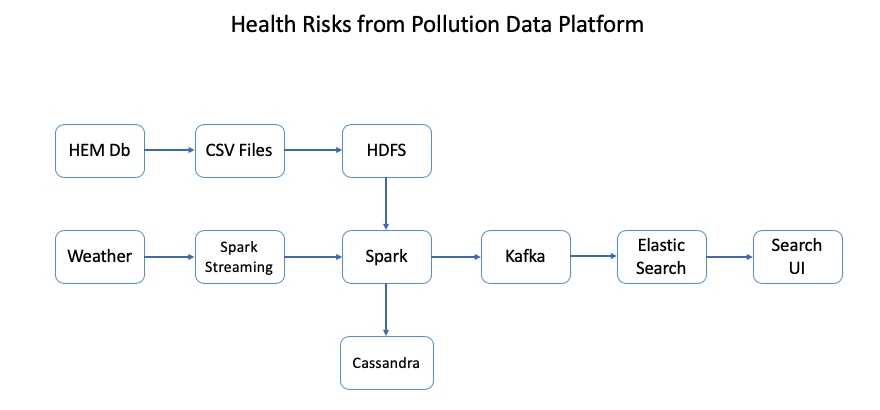

## Architecture:

### Tasks:
1. preprocess data using spark (note: if county data is not available, it has 0 pollutants) - **david, aditya** [DONE see
   process_risk.py]
2. load elasticsearch with pre-processed data - **praba** [DONE]
3. convert address to FIPS code (just the county part) at query time - **anthony** [DONE]
